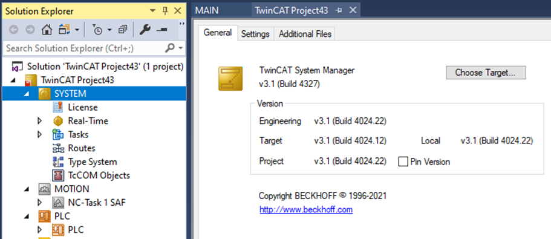

# TwinCAT BSoD Reporting Guide

## Disclaimer

This is a personal guide not a peer reviewed journal or a sponsored publication. We make
no representations as to accuracy, completeness, correctness, suitability, or validity of any
information and will not be liable for any errors, omissions, or delays in this information or any
losses injuries, or damages arising from its display or use. All information is provided on an as
is basis. It is the reader’s responsibility to verify their own facts.

The views and opinions expressed in this guide are those of the authors and do not
necessarily reflect the official policy or position of any other agency, organization, employer or
company. Assumptions made in the analysis are not reflective of the position of any entity
other than the author(s) and, since we are critically thinking human beings, these views are
always subject to change, revision, and rethinking at any time. Please do not hold us to them
in perpetuity.

## Overview

The following information will be required to analyze a BSoD.

1. A Screenshot or Dump File
2. Timing Information
3. TwinCAT Version Information
4. What target system hardware is used
5. Image Version, Windows and System Information (Target)
6. List of installed software (Target and XAE)
7. Runtime settings (Core configuration, Task priority, Task graph)

## Where to find the information

### A Screenshot and or Dump File

A screenshot or photo of the bluescreen can be made at the time. If available, then send the dmp file from the following folder. `C:\Windows\minidump`

## Timing Information:

When did the BSOD occur
• During commissioning? (directly after the first activation, after a project change).
• Production plant that has been running for a long time without any problems?
• Were updates applied PLC, Windows, firmware, third-party software,...?
• In a Test Environment?

Can the BSoD be reproduced?

Is there a previous version of the project with which the behavior does not occur?
• Compare both projects with the "TwinCAT Project Compare", where is the difference?

### TwinCAT Version Information

Information can be read here:

### What target system hardware is used

Example: Beckhoff CX5130-0143 or third party PC?
For Beckhoff systems you should include the serial number

### Image Version, Windows and System Information

#### Image Version can be read here:

Enter the IP address or the host name of the Industrial PC in the web browser to start the Beckhoff Device Manager.

- Example IP-Address: https://169.254.136.237/config
- Example Hostname: https://CX-16C2B8/config
- Example local: http://localhost/config/#Device&System

#### Windows Information can be read here:

#### System Information can be read here:

You can use the export facility to save to file.

### List of installed software

Which Software is installed on Target System, and Engineering PC?

### Event viewer log

### Runtime Settings

#### Picture of the Core configuration

#### Picture of the Task priory

#### Picture of each Task's graph + exceed counter

Are there exceed counters in the tasks? Do they count continuously up, or do they only occur after the restart?

## Check Bounds

In most cases memory exceptions are rasied when you access an array using an index which is out of bounds.

To diagnose this type of exception then CheckBounds POUs can be used to handle and count how often this happens in your program. Remember, there should never be reason to go outside of the bounds of an array. The CheckBounds example is found in the src folder.
